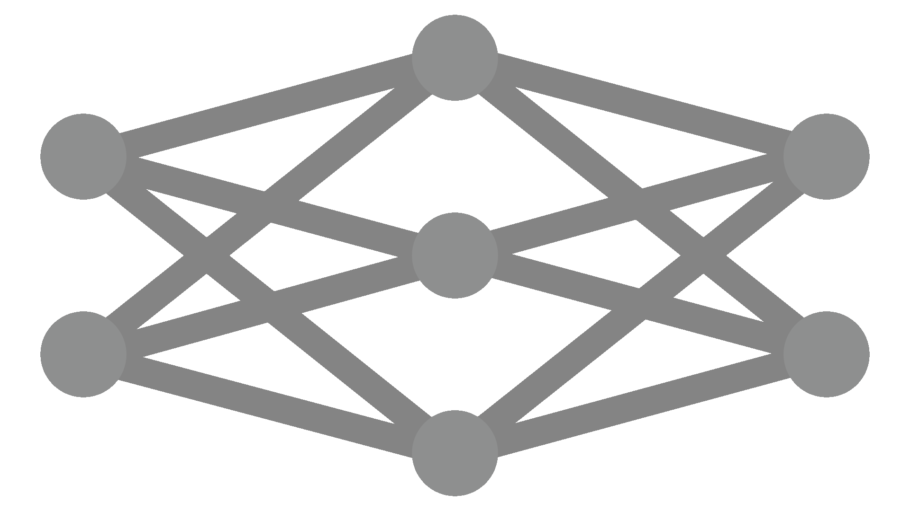

# Welcome to My World of AI Innovation! 👋🌐

I'm Liubomyr, a passionate explorer at the intersection of machine learning and creative problem-solving.

  

## 🧐 About Me

- 🌱 **Curiosity Driven**: Delving into AI's depths to unearth new possibilities.
- 💡 **Innovator at Heart**: Blending data, algorithms, and out-of-the-box thinking.
- 🎯 **Impactful Solutions**: Crafting AI tools that make a real difference.

## 🛠️ My Technical Toolbox

- My go-to language for data science and AI.

- Where I build and refine neural networks.

- The backbone for my diverse ML applications.
- 

- Transforming data into insights with powerful visualizations.

## 🌟 Spotlight on Projects

Dive into my [repositories](https://github.com/guyfloki?tab=repositories) to see my work in action, like [Project Name], a [brief project description].

## 🤝 Connect and Collaborate

I thrive on collaboration and insightful AI conversations. Let's connect and contribute to the future of AI!

📫 Reach me at: [guyfloki@gmail.com](guyfloki@gmail.com)

---

Your visit is much appreciated. Here's to shaping a future brimming with innovative AI solutions!
